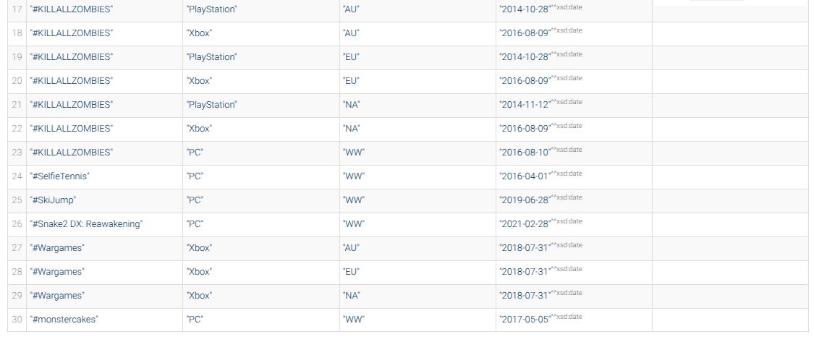
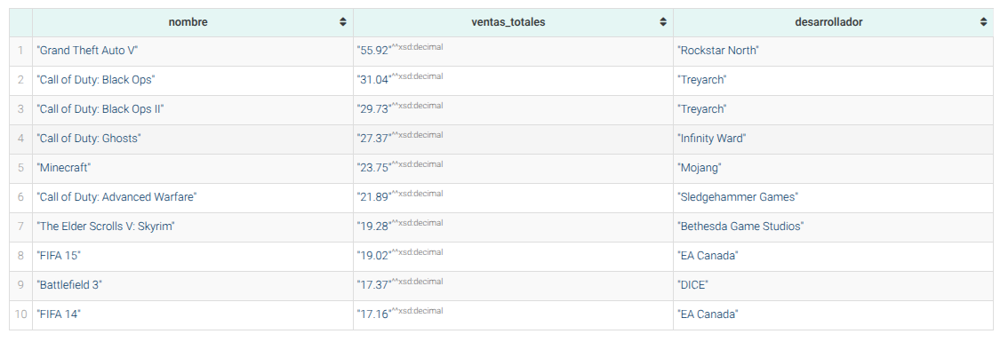
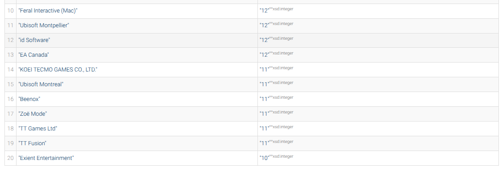
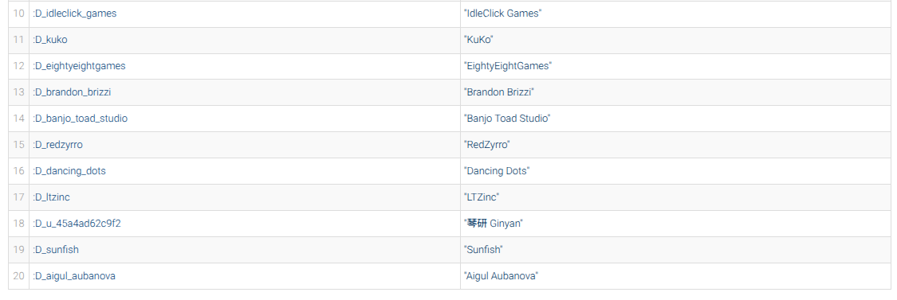
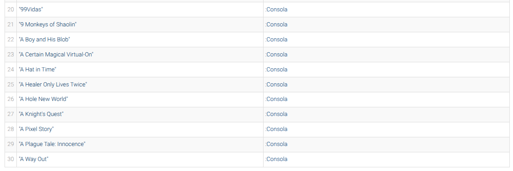
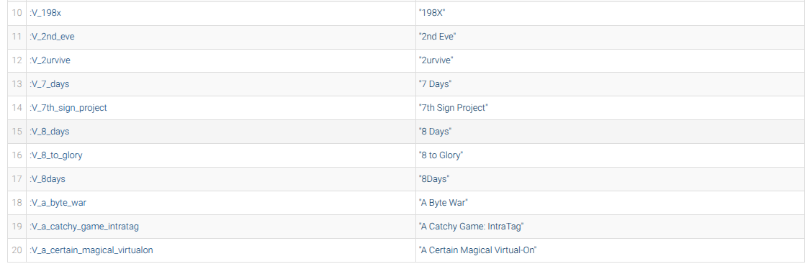
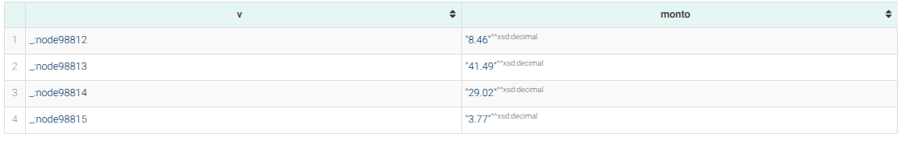
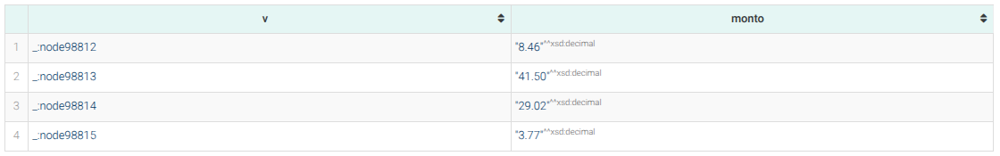

# Reporte — Justificación de fuentes de datos

## 1. Datasets seleccionados

| Fuente | Formato | Registros | Aporte único | Errores conocidos |
|--------|---------|-----------|--------------|-------------------|
| Ventas globales (vgsales) | CSV | 16,598 | Ventas por región (NA, EU, JP, Other) | `Year` nulo (1.6%), `Publisher` = `"Unknown"` (1.2%) |
| Steam | CSV | 94,948 | Precio, reseñas, tiempo de juego, desarrollador | `metacritic_score=0` (96.2%), `estimated_owners="0 - 0"` (14.4%) |
| Consolas (Xbox, PS, Switch) | JSON | 2,279 / 1,151 / 1,043 | Fechas de lanzamiento por 4 regiones | `genre` vacío en Xbox (64.6%) y PS (87.1%), fechas `"Unreleased"` |

**Complementariedad:** Ninguna fuente por sí sola permite cruzar ventas + métricas digitales + fechas regionales.

## 2. Justificación del grafo de conocimiento

- **Relaciones parciales:** `desarrolladoPor` solo está en Steam/consolas; `publicadoPor` varía por plataforma; `perteneceAGenero` está ausente en 64-87% de consolas. Un grafo RDF maneja esto sin columnas NULL.
- **Jerarquía de dos niveles:** El mismo juego (Videojuego) puede tener múltiples Lanzamientos con distintos editores, fechas y ventas según la plataforma.
- **Inferencia nativa:** La jerarquía `Consola ⊑ Plataforma` permite consultas sobre todas las consolas sin enumerarlas explícitamente.

## 3. Problemas de calidad identificados

| Problema | Fuente(s) | Tratamiento |
|---|---|---|
| `Year` nulo | Ventas | Se omite la fecha |
| `Publisher` = "Unknown" o NaN | Ventas | No se añade editor |
| `metacritic_score = 0` (placeholder) | Steam | Se omite la propiedad |
| Listas serializadas (genres, developers) | Steam | Parseo con `ast.literal_eval` |
| `genre` vacío | Xbox (64.6%), PS (87.1%) | Se omite el género |
| Fechas "Unreleased"/"TBA" | Consolas (Japón 42-48%) | Se descartan |
| Publishers con prefijo regional | Switch | Limpieza de prefijos |
| Nombres con TM/®/apóstrofes Unicode | Steam | Normalización en matching |
| Duplicados de nombre+plataforma | Ventas | Deduplicación por clave compuesta |
| DOOM (1993) y DOOM (2016) | Todas | Desambiguación manual en código |

## Consultas

### Consulta 1: Libre — Juegos con fechas de lanzamiento por región y ventas
Recupera nombre, plataforma, región, fecha y ventas (OPTIONAL). Demuestra integración de las 3 fuentes.

| nombre | plataforma | region | fecha | ventas |
|--------|-----------|--------|-------|--------|
| ! Shakabula \* | PC | WW | 2023-10-13 | |
| #KILLALLZOMBIES | PlayStation | NA | 2014-11-12 | |
| #KILLALLZOMBIES | Xbox | NA | 2016-08-09 | |
| #KILLALLZOMBIES | PC | WW | 2016-08-10 | |
| #SelfieTennis | PC | WW | 2016-04-01 | |
| #Wargames | Xbox | NA | 2018-07-31 | |
| #Wargames | Xbox | EU | 2018-07-31 | |

### Consulta 2: Agregación (SUM) — Top 10 juegos más vendidos
Suma ventas regionales agrupando por juego y desarrollador.

| nombre | ventas_totales | desarrollador |
|--------|---------------|---------------|
| Grand Theft Auto V | 55.92 | Rockstar North |
| Call of Duty: Black Ops | 31.04 | Treyarch |
| Call of Duty: Black Ops II | 29.73 | Treyarch |
| Call of Duty: Ghosts | 27.37 | Infinity Ward |
| Minecraft | 23.75 | Mojang |
| Call of Duty: Advanced Warfare | 21.89 | Sledgehammer Games |
| The Elder Scrolls V: Skyrim | 19.28 | Bethesda Game Studios |
| FIFA 15 | 19.02 | EA Canada |
| Battlefield 3 | 17.37 | DICE |
| FIFA 14 | 17.16 | EA Canada |

### Consulta 3: GROUP BY + HAVING — Desarrolladores con ≥2 plataformas
Cuenta plataformas distintas por desarrollador, filtrando con HAVING.

| desarrollador | plataformas |
|---------------|------------|
| Capcom | 18 |
| Square Enix | 17 |
| Criterion Games | 15 |
| Avalanche Software | 15 |
| Vicarious Visions | 14 |
| Traveller's Tales | 14 |
| Arc System Works | 13 |
| THQ Nordic | 13 |
| TT Games | 13 |
| Feral Interactive (Mac) | 12 |

### Consulta 4: Property Paths (/) — Desarrolladores que publican sus propios juegos
Usa `tieneLanzamiento / publicadoPor / nombre` para encontrar estudios indie que se autopublican.

| dev | nombre |
|-----|--------|
| D_cgndc | CGNDC |
| D_softweir_inc | SoftWeir Inc. |
| D_zero_day_games | Zero Day Games |
| D_colorfiction | Colorfiction |
| D_half_phai | Half/Phai |
| D_sandstrom | Sandstrom |
| D_idleclick_games | IdleClick Games |
| D_kuko | KuKo |
| D_eightyeightgames | EightyEightGames |
| D_8floor | 8floor |

### Consulta 4b: Property Paths + Inferencia (subClassOf\*) — Juegos en consolas
Usa `rdfs:subClassOf*` para explotar la jerarquía `Consola ⊑ Plataforma`. Lista juegos en cualquier consola sin enumerarlas.

| nombreJuego | tipoPlataforma |
|-------------|---------------|
| 1001 Spikes | Consola |
| 100ft Robot Golf | Consola |
| 101 Ways to Die | Consola |
| 10 Second Ninja X | Consola |
| 13 Sentinels: Aegis Rim | Consola |
| 7 Days to Die | Consola |
| A Hat in Time | Consola |
| A Plague Tale: Innocence | Consola |
| A Way Out | Consola |

### Consulta 5: FILTER NOT EXISTS — Juegos sin género asignado
Muestra juegos sin `perteneceAGenero`. Problema real: Xbox 64.6% y PS 87.1% sin dato de género.

| juego | nombre |
|-------|--------|
| V_03 | 03 |
| V_1001_nights | 1001 Nights |
| V_13_sentinels_aegis_rim | 13 Sentinels: Aegis Rim |
| V_198x | 198X |
| V_2urvive | 2urvive |
| V_7_days | 7 Days |
| V_a_certain_magical_virtualon | A Certain Magical Virtual-On |
| V_hat_in_time | A Hat in Time |
| V_plague_tale_innocence | A Plague Tale: Innocence |
| V_way_out | A Way Out |

### Consulta 6: INSERT/DELETE/UPDATE — Corrección de venta regional (Wii Sports NA)
Actualiza monto de 41.49 a 41.50. Se muestra el estado antes, la consulta de actualización, y la verificación posterior.

**Antes del UPDATE:**

| v | monto |
|---|-------|
| node98812 | 8.46 |
| node98813 | 41.49 |
| node98814 | 29.02 |
| node98815 | 3.77 |

**Después del UPDATE (verificación):**

| v | monto |
|---|-------|
| node98812 | 8.46 |
| node98813 | 41.5 |
| node98814 | 29.02 |
| node98815 | 3.77 |

## 4. Validación SHACL

Se definieron 6 reglas SHACL en `ontology/validacion_shacl.ttl` y se ejecutaron contra el grafo final (`output/datos_integrados.ttl`) usando `pyshacl`.

| # | Regla | Shape target | Violaciones |
|---|-------|-------------|------------|
| 1 | Videojuego debe tener al menos un género | `Videojuego` | **3,859** |
| 2 | VentaRegional.monto debe ser xsd:decimal | `VentaRegional` | 0 |
| 3 | Lanzamiento.metacriticScore entre 1 y 100 | `Lanzamiento` | 0 |
| 4 | VentaRegional solo puede tener :region y :monto | `VentaRegional` | 0 |
| 5 | Lanzamiento.precio debe ser xsd:decimal | `Lanzamiento` | 0 |
| 6 | VentaRegional.region debe ser NA, EU, JP o Other | `VentaRegional` | 0 |

**Resultado**: 3,859 violaciones, todas de la regla 1, correspondientes a juegos de Xbox (64.6% sin género) y PlayStation (87.1% sin género). Las reglas 2 a 6 pasaron sin violaciones, confirmando la consistencia de los datos transformados.

El resultado completo se encuentra en `docs/resultado_validacion_shacl.txt`.

